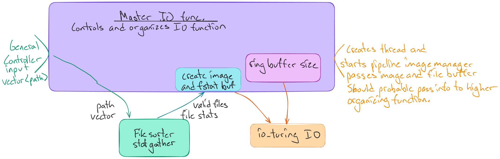

# Needs and requirements

# Current Idea

## io_uring
It firstly solves the issue of mmap not loading the file all at once and keeps the benefit of avoiding the user kernel buffer copying.  As I understand it is the modern standard for hpc.

io_uring is also async allowing for read requests on hundreds of files at once and as it is entirely reasonable that RAW images are stored on slow disks then such measures become very important.  

### layout
Need to implement basic filtering passes on the passed in images to avoid a giant clog of errors later.  Furthermore it means a reduction in costly disk reads later.  Filtering needs to sort non supported files from supported files.  For now this should just let in RAW images.  At this step important stats for the files are logged, for now just how many and the largest file found.

Need to determine or build a thread safe queue or arena containing a specific number of slots set up to store the loaded files.  A separate thread safe data structure stores the file info and a unique ID that heads the memory region the file is loaded into.  

# Old Ideas

## Use mmap for file IO 
As I understand default cpp io operations involve using a user space buffer to allow the kernal to copy file contents into.  Doing so means switching back and forth between the kernal and user space and is thus slower.  Given that raw images are extremely large and that tasks such as processing images are resource intensive tasks the potential for wasting memory isnt a concern.  The lazy loading of the file also results in less thrashing of the OS as it doesnt need to constantly switch between user and kernal space.  It importantly does have any compatability issues with LibRaw or Exif.  

Issues: I dont fully understand it but it appears that mmap for large files doesnt load the file all at the start.  Instead it loads peices as they are accessed with if it occurs too often causes a lot of page faults.  This is 
especially a problem for large images that have their data accessed several times and since many images will be acted on at once it reasonable to see a lot of page faults in the way of conflict misses will occur.  Such is briefly mentioned in the wiki.  Should time permit
would prove an interesting profiling experiment.
